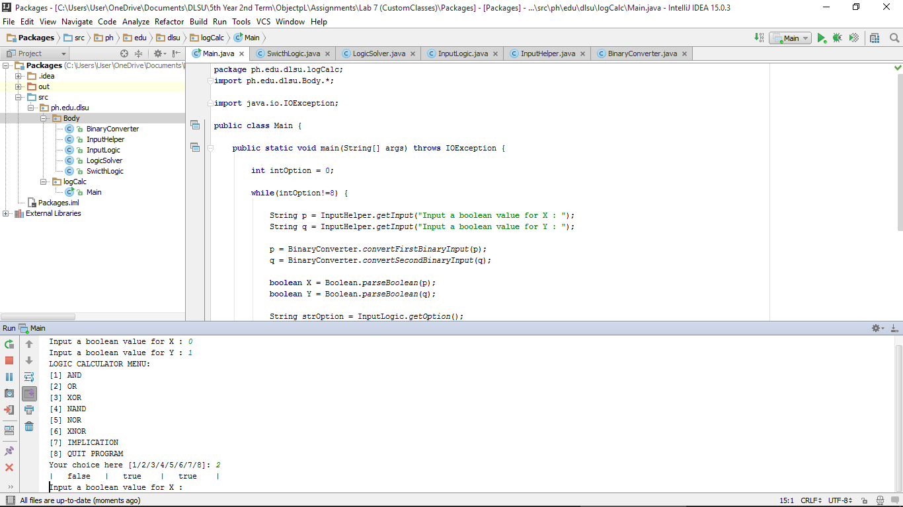

#Packages

Placing Classes inside the packages.

#ScreenShot

#Code

###Main
~~~
package ph.edu.dlsu.logCalc;
import ph.edu.dlsu.Body.*;

import java.io.IOException;

public class Main {

    public static void main(String[] args) throws IOException {

        int intOption = 0;

        while(intOption!=8) {

            String p = InputHelper.getInput("Input a boolean value for X : ");
            String q = InputHelper.getInput("Input a boolean value for Y : ");

            p = BinaryConverter.convertFirstBinaryInput(p);
            q = BinaryConverter.convertSecondBinaryInput(q);

            boolean X = Boolean.parseBoolean(p);
            boolean Y = Boolean.parseBoolean(q);

            String strOption = InputLogic.getOption();

            intOption = Integer.parseInt(strOption);

            SwicthLogic.switchOption(intOption, X, Y);

        }
    }
}
~~~

###SwitchLogic
~~~
package ph.edu.dlsu.Body;

public class SwicthLogic {

    public static void switchOption(int intOption, boolean x, boolean y) {
        switch(intOption) {
            case 1:
                LogicSolver.andTable(x, y);
                break;
            case 2:
                LogicSolver.orTable(x, y);
                break;
            case 3:
                LogicSolver.xorTable(x, y);
                break;
            case 4:
                LogicSolver.nandTable(x, y);
                break;
            case 5:
                LogicSolver.norTable(x, y);
                break;
            case 6:
                LogicSolver.xnorTable(x, y);
                break;
            case 7:
                LogicSolver.impliTable(x, y);
                break;
            case 8:
                System.out.println("Program Terminated.");
                break;
            default:
                System.out.println("Input cannot be recognized.");
                break;
        }
    }

}
~~~

###LogicSolver
~~~
package ph.edu.dlsu.Body;

public class LogicSolver {

    public static void impliTable(boolean x, boolean y) {
        System.out.println("|\t" + x + "\t|\t" + y + "\t|\t" + !(x && !y) + "\t|");
    }

    public static void xnorTable(boolean x, boolean y) {
        System.out.println("|\t" +x+ "\t|\t" +y+ "\t|\t" +!(x ^ y)+ "\t|");
    }

    public static void norTable(boolean x, boolean y) {
        System.out.println("|\t" +x+ "\t|\t" +y+ "\t|\t" +!(x || y)+ "\t|");
    }

    public static void nandTable(boolean x, boolean y) {
        System.out.println("|\t" +x+ "\t|\t" +y+ "\t|\t" +!(x && y)+ "\t|");
    }

    public static void xorTable(boolean x, boolean y) {
        System.out.println("|\t" +x+ "\t|\t" +y+ "\t|\t" +(x ^ y)+ "\t|");
    }

    public static void orTable(boolean x, boolean y) {
        System.out.println("|\t" +x+ "\t|\t" +y+ "\t|\t" +(x || y)+ "\t|");
    }

    public static void andTable(boolean x, boolean y) {
        System.out.println("|\t" +x+ "\t|\t" +y+ "\t|\t" +(x && y)+ "\t|");
    }

}
~~~

###InputLogic
~~~
package ph.edu.dlsu.Body;

public class InputLogic {

    public static String getOption() {
        System.out.println("LOGIC CALCULATOR MENU:");
        System.out.println("[1] AND");
        System.out.println("[2] OR");
        System.out.println("[3] XOR");
        System.out.println("[4] NAND");
        System.out.println("[5] NOR");
        System.out.println("[6] XNOR");
        System.out.println("[7] IMPLICATION");
        System.out.println("[8] QUIT PROGRAM");

        return InputHelper.getInput("Your choice here [1/2/3/4/5/6/7/8]: ");
    }

}
~~~

###InputHelper
~~~
package ph.edu.dlsu.Body;

import java.io.BufferedReader;
import java.io.InputStreamReader;

public class InputHelper {

    public static String getInput(String prompt) {
        BufferedReader stdin = new BufferedReader(
                new InputStreamReader(System.in));

        System.out.print(prompt);
        System.out.flush();

        try {
            return stdin.readLine();
        } catch (Exception e) {
            return "Error: " + e.getMessage();
        }
    }

}
~~~

###BinaryConverter
~~~
package ph.edu.dlsu.Body;

public class BinaryConverter {

    public static String convertSecondBinaryInput(String q) {
        if (q.equals("1"))
            q = "true";

        if (q.equals("0"))
            q = "false";

        return q;
    }

    public static String convertFirstBinaryInput(String p) {
        if (p.equals("0"))
            p = "false";

        if (p.equals("1"))
            p = "true";

        return p;
    }

}
~~~
